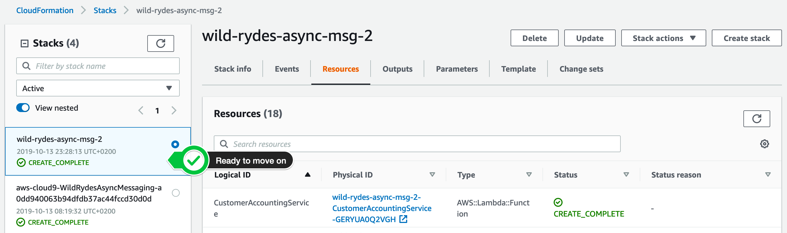
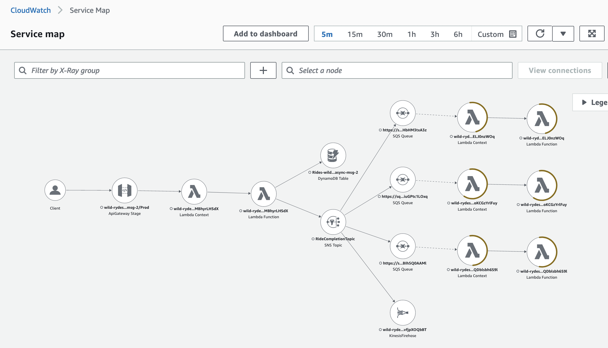

# Introducing Amazon SNS with AWS X-Ray active tracing

This repository is to support the AWS Compute Blog - [Monitor your SNS-based applications end-to-end with AWS X-Ray Active Tracing](#).

> **Important:** _this application uses various AWS services and there are costs associated with these services after the Free Tier usage - please see the [AWS Pricing page](https://aws.amazon.com/pricing/) for details. You are responsible for any AWS costs incurred. No warranty is implied in this example._

## Sample architecture overview

This sample application demonstrates Amazon SNS with AWS X-Ray active tracing:


This is how the sample architecture works:

1. An AWS API Gateway receiving ride requests from users
2. An AWS Lambda processing ride requests
3. A DynamoDB table that serves as a store for rides
4. An Amazon SNS topic that serves as a fan-out for ride requests
5. Individual Amazon SQS queues and AWS Lambdas set up as buffering load-balancer to process ride requests by various back office services (customer notification, customer accounting, and so on)
6. An SNS message filter is in place for the subscription of the extraordinary rides service
7. A Kinesis Data Firehose delivery streams and archives them in an S3 bucket

Please read the blog post to get additional information about this solution.

## Pre-requisites:

- [Install Git](https://git-scm.com/book/en/v2/Getting-Started-Installing-Git).
- Install or update your AWS Command Line Interface (AWS CLI) to the [latest version](https://docs.aws.amazon.com/cli/latest/userguide/getting-started-install.html).
- Install or update your AWS Serverless Application Model (AWS SAM) CLI to the [latest version](https://docs.aws.amazon.com/serverless-application-model/latest/developerguide/install-sam-cli.html).
- [Configure](https://docs.aws.amazon.com/cli/latest/userguide/cli-configure-files.html) AWS CLI to get access to one of your AWS accounts. If you do not have an AWS account, please follow [instructions](https://portal.aws.amazon.com/gp/aws/developer/registration/index.html) and create one.

## Deployment instructions:

1. Clone/download this GitHub repository
2. Open a command-line tool of your preference, and navigate into the folder where you cloned or extracted this repository
3. Test your AWS SAM installation by running AWS SAM [validate](https://docs.aws.amazon.com/serverless-application-model/latest/developerguide/sam-cli-command-reference-sam-validate.html) command:

   ```bash
   sam validate --lint
   ```

   You should see a message `/path/to/template.yaml is a valid SAM Template`

4. Build the lab artifacts from source:

   ```bash
   sam build
   ```

5. Deploy the sample solution into you configured AWS account by running AWS SAM [deploy](https://docs.aws.amazon.com/serverless-application-model/latest/developerguide/sam-cli-command-reference-sam-deploy.html) command:

   ```bash
   export AWS_REGION=$(aws --profile default configure get region)
   sam deploy \
       --stack-name wild-rydes-async-msg-2 \
       --capabilities CAPABILITY_IAM \
       --region $AWS_REGION \
       --guided
   ```

   Confirm the first 5 proposed arguments by hitting **ENTER**. When you get asked **SubmitRideCompletionFunction may not have authorization defined, Is this okay? [y/N]:**, enter `y` and hit **ENTER** for remaining options.

6. Wait until the stack is successfully deployed.

   It takes usually 5 minutes until the stack launched. You can monitor the progress of the **wild-rydes-async-msg-2** stack in your SAM CLI or your [AWS CloudFormation Console](https://console.aws.amazon.com/cloudformation). When the stack is launched, the status will change from **CREATE_IN_PROGRESS** to **CREATE_COMPLETE**.

   

   In the meantime while your waiting, you may want to have a look at the AWS SAM template to make yourself familiar with the stack we launched. Just click on the **template.yaml** attachment below to see the content.

## Test the application

In this step, we will validate that the Amazon SNS topic is publishing all messages to all subscribers. Because a subscriber can also fail processing a message, we also want to validate that Amazon SNS is redelivering the message, so that we will not miss a single message.

1. Look up the API Gateway endpoint:

   To look-up the API Gateway endpoint URL for the **submit-ride-completion** function, run the following command:

   ```bash
   export AWS_REGION=$(aws --profile default configure get region)
   aws cloudformation describe-stacks \
       --stack-name wild-rydes-async-msg-2 \
       --query 'Stacks[].Outputs[?OutputKey==`UnicornManagementServiceApiSubmitRideCompletionEndpoint`].OutputValue' \
       --output text
    ```

2. Send a couple requests to the Unicorn Management Service:

   Let's store this API Gateway endpoint URL in an environment variable, so we don't have to repeat it all the time:

   ```bash
   export ENDPOINT=$(aws cloudformation describe-stacks \
       --stack-name wild-rydes-async-msg-2 \
       --query 'Stacks[].Outputs[?OutputKey==`UnicornManagementServiceApiSubmitRideCompletionEndpoint`].OutputValue' \
       --output text)
   ```

   To send a couple requests to the **submit ride completion endpoint**, execute the command below 5 or more times and change the request payload to test the filter criteria for the **Extraordinary Rides Service**:

   ```bash
   curl -XPOST -i -H "Content-Type\:application/json" -d '{ "from": "Berlin", "to": "Frankfurt", "duration": 420, "distance": 600, "customer": "cmr", "fare": 256.50 }' $ENDPOINT
   ```

3. Validate messages being passed in the application:

   Go to your Amazon [CloudWatch X-Ray traces Service Map](https://console.aws.amazon.com/cloudwatch/home?#xray:service-map) in the AWS Console. Make sure the right region is selected.

   Send a few more requests as described in the previous step. The service map will display the traces captured from the messages sent to the API Gateway and passed along to the consumers.

   

   Click on a node to view more details on the traces that were captured.

## Clean-up instructions:

In this step, we will clean up all resources, we created during this example, so that no further cost will occur.

1. Delete the contents of the S3 archival bucket:

   Run the following command to delete all objects in the S3 bucket:

   ```bash
   export S3_ARCHIVAL_BUCKET=$(aws cloudformation describe-stacks \
       --stack-name wild-rydes-async-msg-2 \
       --query 'Stacks[].Outputs[?OutputKey==`RidesDeliveryArchiveBucket`].OutputValue' \
       --output text)
   aws s3 rm s3://$S3_ARCHIVAL_BUCKET --recursive
   ```

2. Delete the AWS SAM template:

   Run the following command to delete the resources we created with our AWS SAM template:

   ```bash
   aws cloudformation delete-stack \
       --stack-name wild-rydes-async-msg-2
   ```

   Or you can follow [this link](https://console.aws.amazon.com/cloudformation/home?#/stacks) to view all CloudFormation Stacks. Select **wild-rydes-async-msg-2** and click on **Delete**.

3. Delete the AWS Lambda created Amazon CloudWatch Log Group:

   Run the following command to delete all the log groups associated with the labs.

   ```bash
   aws logs describe-log-groups --query 'logGroups[*].logGroupName' --output table | awk '{print $2}' | \
       grep ^/aws/lambda/wild-rydes-async-msg-2 | while read x; \
       do  echo "deleting $x" ; aws logs delete-log-group --log-group-name $x; \
   done
   ```

   Or you can follow [this link](https://console.aws.amazon.com/cloudwatch/home#logsV2:log-groups) to list all ***Amazon CloudWatch Log Groups***. Please filter with the prefix `/aws/lambda/wild-rydes-async-msg-2`, to find all CloudWatch Log Groups AWS Lambda created during this lab. Select all the Amazon CloudWatch Log Group one after each other and choose **Delete log group** from the **Actions** menu.

## Going further

Go to the [Asynchronous Messaging Workshop](https://async-messaging.workshop.aws/) for more labs covering different aspects and patterns of asynchronous messaging and enable AWS X-Ray tracing on the labs provided.

## Security

See [CONTRIBUTING](CONTRIBUTING.md) for more information.

## License

This library is licensed under the MIT-0 License. See the [LICENSE](LICENSE) file.
